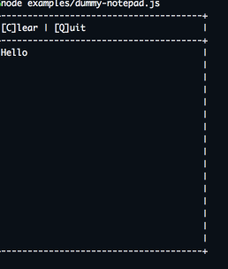
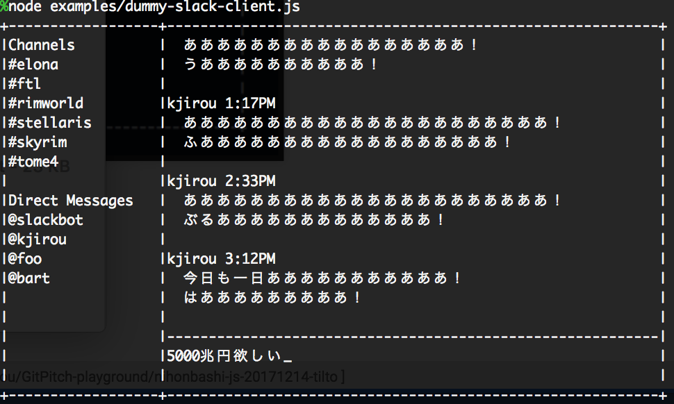
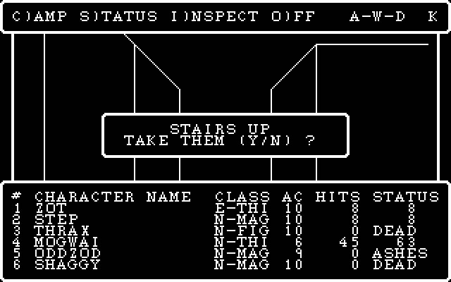

tilto

A TUI (Text User Interface) renderer

---

### 自己紹介

- 株式会社マネーフォワード
- フロントエンド周りのお仕事
- 今回の話は両方ともあんまり関係ない

---

### tilto とは

- TUI を構築するための描画エンジン
- `render(state) -> view` の `render`
- 今回 `view` に相当するのはテキスト
- star 数は 0 (三時間前に publish)

---

### TUI とは

- GUI に対しての用語
- Vim とか Emacs とかそういうのだと思う

---

### モチベーション(前向き)

こういうゲームが好き。（画像は [変愚蛮怒公式サイト](http://hengband.osdn.jp/) より）


---

### モチベーション(後向き)

- 手軽に動かせるものが好き
- だからフロントをやっている
- でもビルドめんどい
- percel すらめんどい

---

## 錯乱

ターミナルで

動くものを作ればいいんだ！

---

### どんな感じ

```js
const tilto = require('tilto');

// 枠を作る
let box = tilto.createBox({width: 20, height: 5});
// 枠線をつける
box = tilto.setBorderType(box, 'default');
// コンテンツを定義する
box.content = 'The quick brown fox jumps over the lazy dog.';

// render でテキスト化
console.log(tilto.render(box));
// -> +------------------+
//    |The quick brown fo|
//    |x jumps over the l|
//    |azy dog.          |
//    +------------------+
```

---

### これ下に流れないの？

- はい。上のサンプルだと普通に流れる
- [log-update](https://github.com/sindresorhus/log-update) の併用が前提

---

### log-update とは

- `console.log` の代わりに `logUpdate` を使うとその場で描画するようになる
- sindresorhus 御大作
- README を見ればすぐわかる

---

### 組み合わせて作れるもの



---

### 妄想しているもの(1)



---

### 妄想しているもの(2)



---

### 現在の進捗

- まだ基礎部分もダメ
  - 特に ANSI 対応
- シュッと作れるようなショートハンドが欲しい
  - 今は状態を手動で組み立てる必要がある

---
